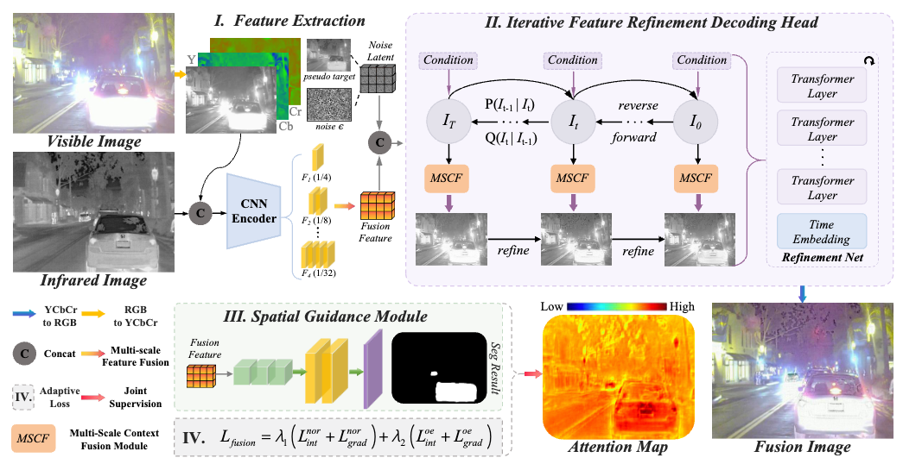
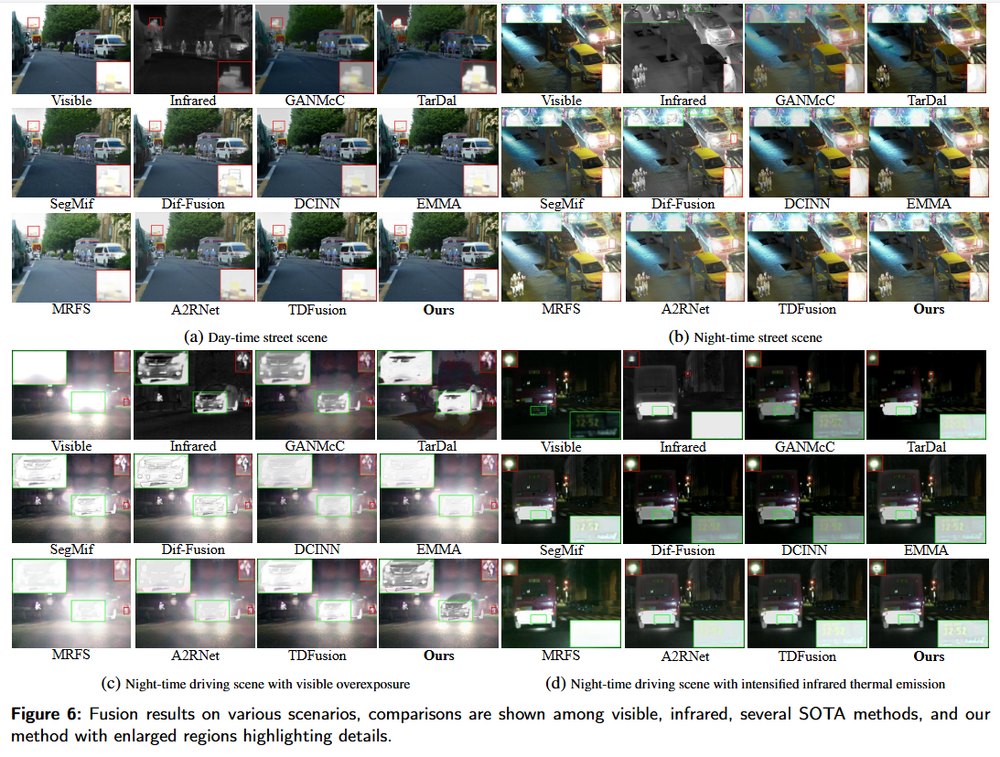
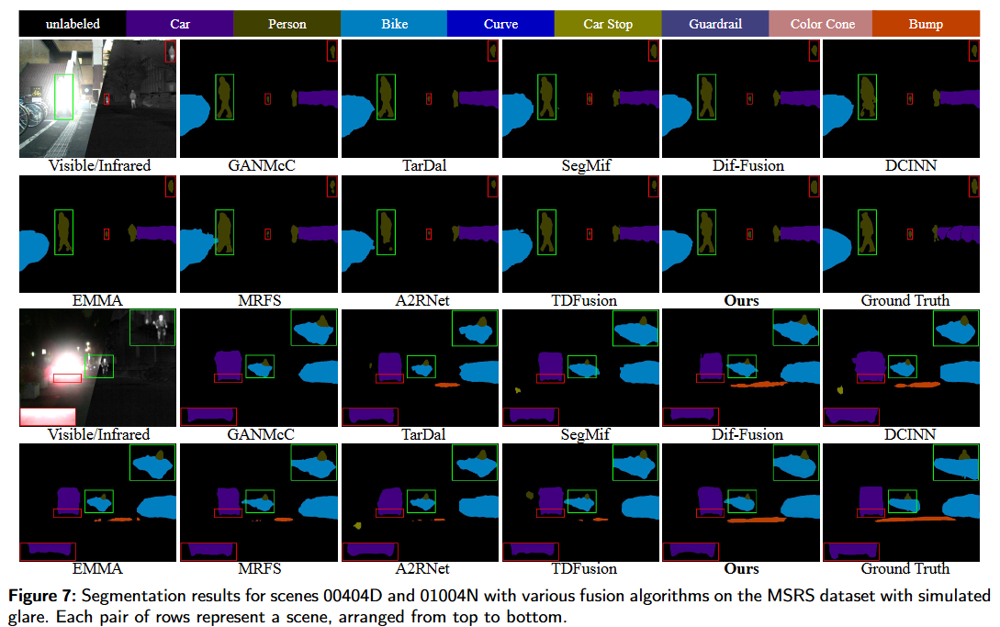
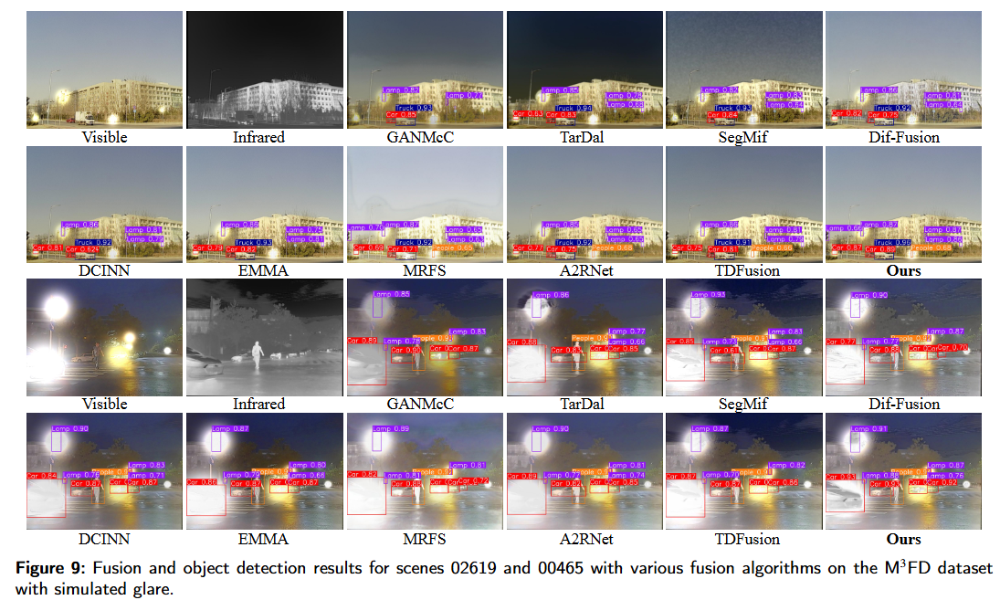

# EPOFusion
This is official Pytorch implementation of "[EPOFusion: Exposure-aware Progressive Optimization Method for Infrared and Visible Image Fusion](https://arxiv.org/abs/2603.16130)"
 - 

## 📌 Key Features

- ✅ **Exposure-aware guidance module** to focus on overexposed infrared regions  
- 🔁 **Iterative decoding fusion module** with diffusion-inspired progressive refinement  
- 🧠 **Multi-Scale Context Fusion (MSCF)** module for detail preservation  
- 🎯 **Adaptive loss function** balancing intensity and texture constraints  
- 📸 **IVOE dataset** (2,315 training pairs + 176 real-world test pairs) with pixel-level annotations for overexposed areas  

## Framework


## 🚀 Recommended Environment
 - [ ] torch  1.13.1
 - [ ] cudatoolkit 11.8
 - [ ] torchvision 0.14.0
 - [ ] mmcv  2.2.1
 - [ ] mmcv-full 1.7.2
 - [ ] mmsegmentation 0.30.0
 - [ ] numpy  1.26.4
 - [ ] opencv-python 4.10.0.84

## Experiments 
### Dataset & Checkpoints & Results
The checkpoints and results can be in [EPOFusion](https://drive.google.com/drive/folders/1xqN_HHsKdtJNf2SjUSUhvTbi3HRCrBfg?usp=sharing). Download IVOE dataset from [IVOE](), MSRS dataset from [MSRS](https://pan.baidu.com/s/18q_3IEHKZ48YBy2PzsOtRQ?pwd=MSRS) and the FMB dataset from [FMB](https://drive.google.com/drive/folders/1T_jVi80tjgyHTQDpn-TjfySyW4CK1LlF).
If you need to evaluate other datasets, please organize them as follows:
```
├── /dataset
    IVOE/
    ├── test
    │   ├── ir
    │   ├── Segmentation_labels
    │   ├── Segmentation_visualize
    │   └── vi
    └── train
        ├── ir
        ├── Segmentation_labels
        └── vi
    MSRS/
    ├── test
    │   ├── ir
    │   ├── Segmentation_labels
    │   ├── Segmentation_visualize
    │   └── vi
    │
    └── train
        ├── ir
        ├── Segmentation_labels
        └── vi
    ......
```
### Evaluate model
python
```
python test_model.py
```
### run sample
python
```
python test_demo.py --img="./images/00131D_vi.png" --ir="./images/00131D_ir.png" --checkpoint="./exps/best.pth" 
```
### To Train
Before training EPOFusion, you need to download the IVOE dataset putting it in ./datasets.

Then running 
python
```
python train_model.py
```
### Fusion comparison

### Downstream tasks comparison


## If this work is helpful to you, please cite it as：
```
@inproceedings{Wang2026EPOFusionEA,
  title={EPOFusion: Exposure aware Progressive Optimization Method for Infrared and Visible Image Fusion},
  author={Zhiwei Wang and Yayu Zheng and Defeng He and Li Zhao and Xiaoqin Zhang and Yuxing Li and Edmund Y. Lam},
  year={2026},
  url={https://api.semanticscholar.org/CorpusID:286579921}
}
```
## Acknowledgements
