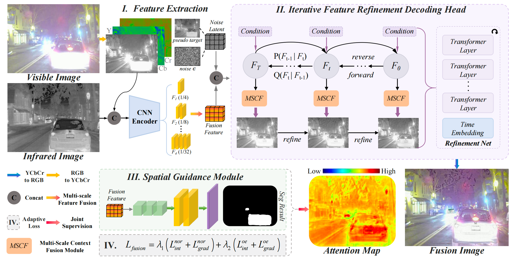
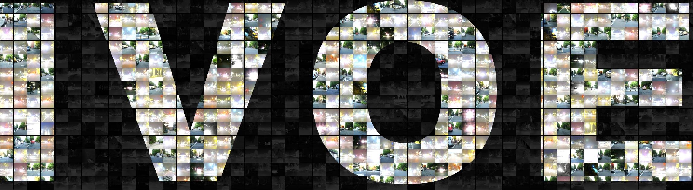
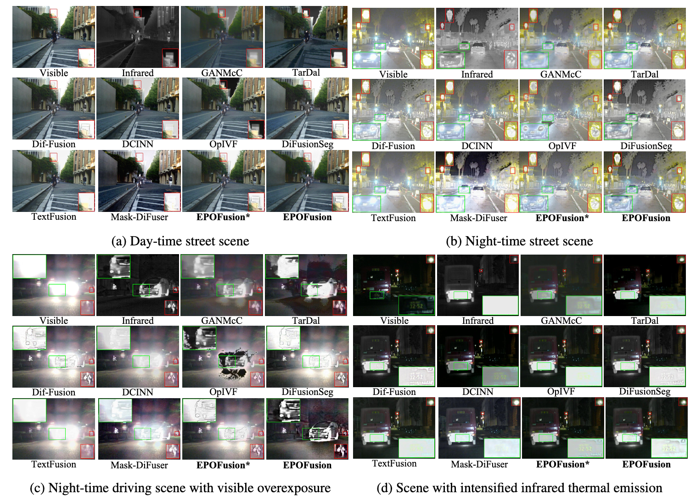

# EPOFusion

Official project repository for **EPOFusion: Exposure-aware Progressive Optimization for Infrared and Visible Image Fusion**.

Zhiwei Wang · Defeng He · Li Zhao · Xiaoqin Zhang · Yuxing Li · Edmund Y. Lam

[Paper](https://arxiv.org/abs/2603.16130) · [IVOE Dataset](https://huggingface.co/datasets/Warren-wzw/IVOE) · [Checkpoints and Results](https://drive.google.com/drive/folders/1xqN_HHsKdtJNf2SjUSUhvTbi3HRCrBfg?usp=sharing)

## Overview

EPOFusion is designed for infrared and visible image fusion in scenes where strong illumination saturates the visible image and erases useful structures. It uses complementary infrared information to recover content that is unreliable or missing in over-exposed visible regions.

The framework combines:

- **Exposure-aware guidance** to localize over-exposed visible regions.
- **Iterative decoding fusion** to refine the fused result progressively.
- **Multi-scale context fusion** to preserve fine details and scene context.
- **Adaptive loss balancing** to jointly optimize intensity and texture.

## Architecture



## IVOE Benchmark

**IVOE (Infrared–Visible Over-Exposure)** is a real-world benchmark for evaluating fusion under visible-light saturation. Its annotations focus on targets whose appearance is lost in the visible image but remains distinguishable in the co-registered infrared image.

IVOE provides:

- **447** real over-exposed infrared-visible pairs.
- **3,722** detection boxes across person, bicycle, and car categories.
- Pixel-level segmentation masks for all **447** pairs.
- **51.7%** of frames containing a severely blown-out target.
- **74.1%** of boxes in which infrared preserves more target detail than visible imagery.

Category distribution:

| Person | Bicycle | Car |
| ---: | ---: | ---: |
| 1,993 | 186 | 1,640 |



Download the dataset from [Google Drive](https://huggingface.co/datasets/Warren-wzw/IVOE).

## Resources

| Resource | Download |
| --- | --- |
| IVOE dataset | [Google Drive](https://huggingface.co/datasets/Warren-wzw/IVOE) |
| EPOFusion checkpoints and results | [Google Drive](https://drive.google.com/drive/folders/1xqN_HHsKdtJNf2SjUSUhvTbi3HRCrBfg?usp=sharing) |
| MSRS dataset | [Baidu Netdisk](https://pan.baidu.com/s/18q_3IEHKZ48YBy2PzsOtRQ?pwd=MSRS) |
| FMB dataset | [Google Drive](https://drive.google.com/drive/folders/1T_jVi80tjgyHTQDpn-TjfySyW4CK1LlF) |

## Recommended Environment

- PyTorch 1.13.1
- CUDA Toolkit 11.8
- torchvision 0.14.0
- mmcv 2.2.1
- mmcv-full 1.7.2
- mmsegmentation 0.30.0
- NumPy 1.26.4
- OpenCV-Python 4.10.0.84

## Usage

### Evaluation

```bash
python test_model.py
```

### Single-pair inference

```bash
python test_demo.py \
  --img "./images/00131D_vi.png" \
  --ir "./images/00131D_ir.png" \
  --checkpoint "./exps/best.pth"
```

### Training

Place IVOE under `./datasets/IVOE`, then run:

```bash
python train_model.py
```

## Fusion Results



## Citation

If you find EPOFusion or IVOE useful in your research, please cite:

```bibtex
@article{wang2026epofusion,
  title={EPOFusion: Exposure-aware Progressive Optimization Method for Infrared and Visible Image Fusion},
  author={Wang, Zhiwei and He, Defeng and Zhao, Li and Zhang, Xiaoqin and Li, Yuxing and Lam, Edmund Y},
  journal={arXiv preprint arXiv:2603.16130},
  year={2026}
}
```
